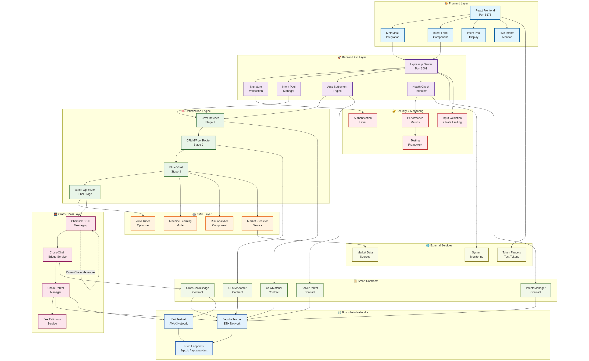

# 🚀 Strategic Solver - Decentralized Intent-Based Autonomous Cross-Chain Solver


## Overview

Strategic Solver is a cutting-edge decentralized cross chain solver that revolutionizes DeFi through **intent-based trading**. Users express their trading intentions, and our sophisticated multi-stage optimization engine finds the best execution path through **Coincidence of Wants (CoW) matching**, **CFMM/AMM pool routing**, and **AI-enhanced parameter optimization**. It uses chainlink CCIP for cross chain intent settlement. The system addresses and improves these real problems and solutions published in Proceedings of the 2024 IEEE International Conference on Blockchain (Blockchain):  ****"From CoWs to Multi-Chain AMMs: A Strategic Optimization Model for Enhancing Solvers” Zeshun Shi∗ , Sydney Sweck† , and Omar Zaki†
∗ Cyber Security Group, Delft University of Technology, the Netherlands
† Composable Foundation, Zug, Switzerland****. 


## Core Concept: Intent-Based Trading

Instead of traditional DEX trading where users specify exact routes and pools, Strategic Solver uses **"intents"** - high-level declarations of what users want to achieve:
// Traditional DEX: "Swap 100 USDC for ETH on Uniswap V2"
// Intent-Based: "I want to get the best ETH price for my 100 USDC"
const intent = {
  sellToken: "USDC",
  buyToken: "ETH", 
  sellAmount: "100",
  userAddress: "0x...",
  minBuyAmount: "0.05", // Optional minimum
  deadline: timestamp
}


## 🏗️ Architecture

```
┌─────────────────┐    ┌──────────────────┐    ┌─────────────────┐
│   Frontend UI   │────│   Backend API    │────│  Smart Contracts│
│  (React + MM)   │    │  (Express.js)    │    │   (Solidity)    │
└─────────────────┘    └──────────────────┘    └─────────────────┘
                              │
                    ┌─────────┼─────────┐
                    │         │         │
            ┌───────▼───┐ ┌───▼───┐ ┌───▼────┐
            │CoW Matcher│ │ Pools │ │ElizaOS │
            │   Engine  │ │Router │ │   AI   │
            └───────────┘ └───────┘ └────────┘

```


### 2. Multi-Stage Optimization Pipeline

#### Stage 1: CoW Matching 🤝
- **Purpose**: Direct user-to-user trading
- **Benefit**: Zero slippage, optimal pricing
- **Speed**: <100ms matching
- **Example**: Alice sells USDC→WETH, Bob sells WETH→USDC = Perfect match!

#### Stage 2: CFMM/Pool Routing 🏊
- **Purpose**: Route through AMM pools when no CoW match
- **Features**: Multi-hop routing in local chain or cross chain, slippage optimization
- **Pools**: Uniswap V2/V3, SushiSwap, etc.

#### Stage 3: ElizaOS AI Enhancement 🧠
- **Purpose**: Parameter optimization and market prediction
- **Features**: ML-based execution timing, gas optimization
- **Learning**: Continuous improvement from execution history

### 3. Automatic Settlement
- **Frequency**: Every 10 seconds
- **Process**: Queue → Optimize → Execute → Settle
- **Monitoring**: Real-time pool updates and match notifications

## 🚀 Quick Start

### Prerequisites
- Node.js 18+
- MetaMask browser extension  
- Sepolia testnet ETH
- Test tokens from faucets

### 1. Start Everything
```bash
cd /home/mg/Strategic-Solver
./start-all.sh
```

### 2. Test with Sample Intents
```bash
# Run comprehensive tests
./test-intents.sh

# Quick CoW matching test
./quick-test.sh
```

### 3. Test via Frontend UI
1. Open http://localhost:5173
2. Connect MetaMask to Sepolia Testnet
3. Submit intents through the form
4. Watch CoW matching in real-time

## 📋 Available Scripts

| Script | Description | Usage |
|--------|-------------|-------|
| `start-all.sh` | Start both frontend and backend | `./start-all.sh` |
| `start-backend.sh` | Backend only (port 3001) | `./start-backend.sh` |
| `start-frontend.sh` | Frontend only (port 5173) | `./start-frontend.sh` |
| `test-intents.sh` | Comprehensive intent testing | `./test-intents.sh` |
| `quick-test.sh` | Fast CoW matching test | `./quick-test.sh` |
| `health-check.sh` | System status check | `./health-check.sh` |

## 🌐 Endpoints & URLs

### Frontend
- **UI**: http://localhost:5173 (or next available port)
- **Features**: MetaMask integration, intent submission, real-time updates

### Backend API
- **Health**: http://localhost:3001/health
- **Intent Pool**: http://localhost:3001/api/intent-pool
- **Submit Intent**: http://localhost:3001/api/submit-intent
- **Optimization Info**: http://localhost:3001/api/optimization-info


## 🔧 Configuration

### Supported Networks
- **Sepolia Testnet** (11155111) - Primary network
- **Avalanche Fuji** (43113) - Cross-chain support

### Supported Tokens
| Token | Sepolia Address | Fuji Address | Faucet |
|-------|----------------|--------------|--------|
| USDC | `0x1c7D4B196Cb0C7B01d743Fbc6116a902379C7238` | `0x5425890298aed601595a70AB815c96711a31Bc65` | [Circle Faucet](https://faucet.circle.com/) |
| WETH | `0xfFf9976782d46CC05630D1f6eBAb18b2324d6B14` | `0x1D308089a2D1Ced3f1Ce36B1FcaF815b07217be3` | [Sepolia Faucet](https://sepoliafaucet.com/) |
| DAI | `0xFF34B3d4Aee8ddCd6F9AFFFB6Fe49bD371b8a357` | `0x51BC2DfB9D12d9dB50C855A5330fBA0faF761D15` | [Paradigm Faucet](https://faucet.paradigm.xyz/) |
| ETH | Native | Native | [Sepolia Faucet](https://faucet.sepolia.org/) |

### Smart Contracts
```javascript
// Deployed Contract Addresses
{
  "intentsManager": "0x0aFF5cb777a483Fcd96B044ba15F29659519d2e5",
  "solverRouter": "0x0f877020b88035f52B34a14C7E5575c8Cf9cc180", 
  "cowMatcher": "0x9D40c36453eda0a5d565739318356416e2bfaFEe",
  "cfmmAdapter": "0x3cB219D5dFf53b8bc059AAB24da58110Af395679",
  "crossChainBridge": "0x8F543d553Ba97D6986adf668EAb4430c50b8B7d3"
}
```

## 🧪 Testing Scenarios

### 1. CoW Matching Test
```bash
# Submit matching intents
curl -X POST http://localhost:3001/api/submit-intent \
  -H "Content-Type: application/json" \
  -d '{
    "sellToken": "USDC", "buyToken": "WETH",
    "sellAmount": "3000", "minBuyAmount": "1.4",
    "userAddress": "0xAlice...", "chainId": 11155111
  }'

curl -X POST http://localhost:3001/api/submit-intent \
  -H "Content-Type: application/json" \
  -d '{
    "sellToken": "WETH", "buyToken": "USDC", 
    "sellAmount": "1.5", "minBuyAmount": "2800",
    "userAddress": "0xBob...", "chainId": 11155111
  }'

# Result: Instant CoW match! 🎉
```

### 2. Frontend UI Test
1. **Connect MetaMask**: Switch to Sepolia testnet
2. **Get Test Tokens**: Use faucets to get USDC, WETH, DAI
3. **Submit Intent**: 
   - Sell: 100 USDC
   - Buy: 0.05 WETH minimum
   - Click "Submit Intent"
4. **MetaMask Prompts**:
   - Approve token (if first time)
   - Sign intent message
5. **Watch Results**: Intent enters optimization pipeline

### 3. Batch Optimization Test
```bash
./test-intents.sh
# Choose option 3: Multiple intents for batch optimization
# Submits 4 different intents and shows optimization results
```

## 📊 Monitoring & Analytics

### Intent Pool Status
```bash
curl -s http://localhost:3001/api/intent-pool | jq
```

**Response:**
```json
{
  "status": "success",
  "pool": {
    "totalIntents": 15,
    "pendingIntents": 3,
    "matchedIntents": 12,
    "pending": [...],
    "recentMatches": [...]
  }
}
```

### Optimization Pipeline Info
```bash
curl -s http://localhost:3001/api/optimization-info | jq
```

### Real-Time Logs
- **Backend**: Watch terminal for optimization pipeline logs
- **Frontend**: Browser console for MetaMask interactions
- **Pool Updates**: Automatic refresh every 10 seconds

## 🔐 Security Features

### MetaMask Integration
- **Signature Verification**: All intents must be signed
- **Address Validation**: Signature must match user address
- **Replay Protection**: Timestamp-based nonce system

### Smart Contract Security
- **Access Control**: Role-based permissions
- **Reentrancy Protection**: Standard guards
- **Slippage Protection**: Minimum amount guarantees

### Backend Security
- **Input Validation**: Comprehensive intent validation
- **Rate Limiting**: API endpoint protection
- **Error Handling**: Graceful failure modes

## 🚨 Troubleshooting

### Common Issues

**Backend won't start**:
```bash
# Check .env file exists
ls backend/.env

# Install dependencies
cd backend && npm install

# Check port availability
lsof -i :3001
```

**Frontend blank page**:
```bash
# Clear browser cache
# Check browser console for errors
# Restart frontend
./start-frontend.sh
```

**MetaMask connection issues**:
1. Switch to Sepolia testnet in MetaMask
2. Reset account if transactions stuck
3. Import test tokens manually if needed

**CoW matching not working**:
- Ensure intent amounts are compatible
- Check time remaining on intents
- Verify both intents are on same chain
- Wait for settlement cycle (10s)

### Debug Commands
```bash
# Check system health
./health-check.sh

# View backend logs
tail -f backend/logs/server.log

# Test API endpoints
curl http://localhost:3001/health
curl http://localhost:3001/api/intent-pool
```

## 🛣️ Roadmap

### Phase 1: ✅ Core Features (Completed)
- ✅ Intent-based trading architecture
- ✅ CoW matching engine
- ✅ MetaMask integration
- ✅ Multi-stage optimization
- ✅ Real-time settlement
- ✅  Cross-chain intent bridging

### Phase 2: 🚧 Advanced Features (In Progress)
- 🔄 Advanced pool routing algorithms
- 🔄 MEV protection mechanisms
- 🔄 Batch auction optimization

### Phase 3: 📋 Future Enhancements
- 📋 Mainnet deployment
- 📋 Mobile app support
- 📋 Additional chain support
- 📋 Governance token launch
- 📋 Institutional trading features
  ```
### Flow Diagram



## 🤝 Contributing

We welcome contributions! Please see our [Contributing Guidelines](CONTRIBUTING.md) for details.

### Development Setup
```bash
# Clone repository
git clone https://github.com/strategic-solver/strategic-solver
cd strategic-solver

# Install dependencies
npm install
cd backend && npm install
cd ../frontend && npm install

# Start development environment
./start-all.sh
```

## 📄 License

This project is licensed under the MIT License - see the [LICENSE](LICENSE) file for details.

## 🙏 Acknowledgments

- **Ethereum Foundation** - For Sepolia testnet infrastructure
- **Avalanche** - For Fuji testnet support
- **MetaMask** - For wallet integration
- **ElizaOS** - For AI/ML optimization framework
- **OpenZeppelin** - For smart contract security patterns

## 📞 Support

- **Email**: moh469@gmail.com

---
